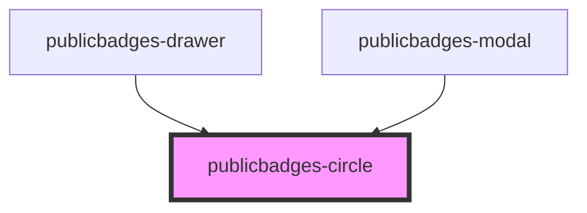

# public-badges-circle

<!-- Auto Generated Below -->

## Properties

| Property      | Attribute      | Description | Type      | Default |
| ------------- | -------------- | ----------- | --------- | ------- |
| `badgesCount` | `badges-count` |             | `number`  | `0`     |
| `interactive` | `interactive`  |             | `boolean` | `false` |
| `testMode`    | `test-mode`    |             | `boolean` | `false` |

## Dependencies

### Used by

 - [publicbadges-drawer](../public-badges-drawer)
 - [publicbadges-modal](../public-badges-modal)

### Graph

----------------------------------------------

*Built with [StencilJS](https://stenciljs.com/)*
