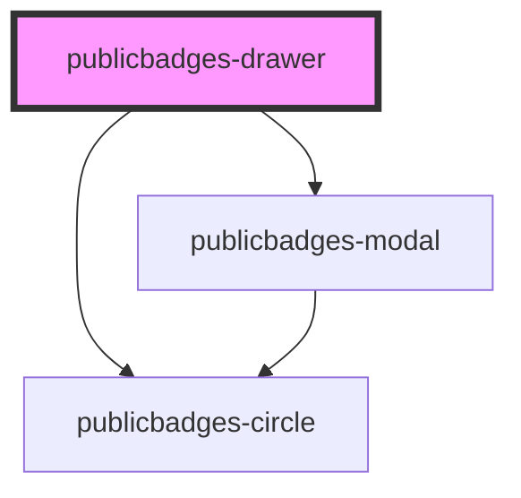

# public-badges-drawer

<!-- Auto Generated Below -->

## Properties

| Property       | Attribute       | Description | Type                | Default                                                                 |
| -------------- | --------------- | ----------- | ------------------- | ----------------------------------------------------------------------- |
| `apiEndpoint`  | `api-endpoint`  |             | `string`            | `"https://69lihfgrc8.execute-api.eu-west-1.amazonaws.com/prod/graphql"` |
| `badgeColor`   | `badge-color`   |             | `string`            | `"#3C3C3C"`                                                             |
| `fontEndpoint` | `font-endpoint` |             | `string`            | `"https://assets.publicspaces.net/@publicbadges/font/"`                 |
| `language`     | `language`      |             | `"EN" \| "NL"`      | `"EN"`                                                                  |
| `modalTheme`   | `modal-theme`   |             | `"dark" \| "light"` | `"light"`                                                               |
| `testDomain`   | `test-domain`   |             | `string`            | `"https://example.org"`                                                 |
| `testMode`     | `test-mode`     |             | `boolean`           | `false`                                                                 |

## Dependencies

### Depends on

- [publicbadges-circle](../public-badges-circle)
- [publicbadges-modal](../public-badges-modal)

### Graph

----------------------------------------------

*Built with [StencilJS](https://stenciljs.com/)*
