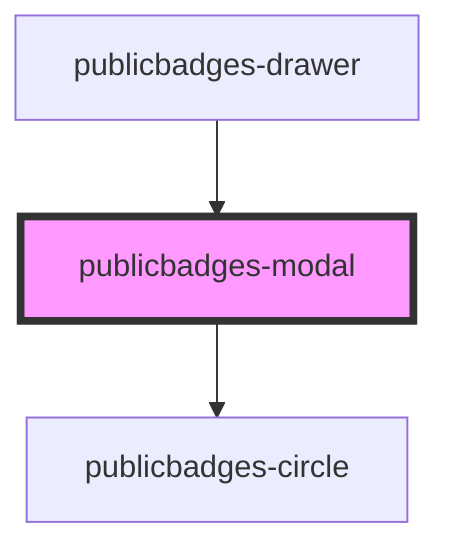

# public-badges-circle

<!-- Auto Generated Below -->

## Properties

| Property      | Attribute  | Description | Type                    | Default                                               |
| ------------- | ---------- | ----------- | ----------------------- | ----------------------------------------------------- |
| `badges`      | --         |             | `ApprovedPublicBadge[]` | `[]`                                                  |
| `language`    | `language` |             | `"EN" or "NL"`          | `"EN"`                                                |
| `positioning` | --         |             | `ModalPositioning`      | `{ orientation: "vertical", left: 0, origin: "top" }` |
| `theme`       | `theme`    |             | `string`                | `""`                                                  |

## Events

| Event         | Description | Type               |
| ------------- | ----------- | ------------------ |
| `closeDrawer` |             | `CustomEvent<any>` |

## Dependencies

### Used by

 - [publicbadges-drawer](../public-badges-drawer)

### Depends on

- [publicbadges-circle](../public-badges-circle)

### Graph

----------------------------------------------

*Built with [StencilJS](https://stenciljs.com/)*
